# Azure Secure Infrastructure (pfSense Hub Gateway)

A centralized, security-focused Azure lab deployed on Microsoft Azure. The design uses a **pfSense NVA (hub gateway)** to centralize routing and security controls, publish a web application through a reverse proxy, provide remote administrative access over VPN, and add observability with monitoring + SIEM.

Public website (published through the lab):
- **https://pfeproject.live**

---

## 1) High-level Goals

- **Centralized routing & segmentation:** Multiple subnets inside one Azure VNet, with traffic forced through pfSense using UDRs.
- **Secure remote admin:** OpenVPN remote access into the management network.
- **Service publishing:** HAProxy on pfSense publishing an internal Nginx web server over HTTPS.
- **Enterprise services demo:** VoIP (Asterisk PBX) accessible via SIP/RTP with correct NAT behavior.
- **Visibility & detection:** Zabbix monitoring and Wazuh SIEM dashboards, with Suricata IDS alerts for suspicious activity.

---

## 2) Services & IP Plan

### Azure VNet
- **VNet:** `10.0.0.0/16`

### Subnets / Workloads

| Subnet | CIDR | Workload(s) | Example IP(s) | Purpose |
|---|---:|---|---|---|
| DCSubnet | `10.0.2.0/24` | `vm-dc` (Windows Server) | `10.0.2.10` | AD DS / DNS |
| VoIPSubnet | `10.0.3.0/24` | `vm-voip` (Asterisk) | `10.0.3.4` | SIP / RTP PBX |
| ClientSubnet | `10.0.4.0/24` | `vm-client` (Windows 10) | `10.0.4.4` | Domain-joined client / testing |
| WebSubnet | `10.0.5.0/24` | `vm-web` (Nginx) | `10.0.5.10` | Internal web service behind HAProxy |
| Management | `10.0.6.0/24` | Jumpbox, Zabbix, Wazuh | `10.0.6.5`, `10.0.6.6`, `10.0.6.7` | Operations / monitoring / SIEM |

### Hub Gateway (pfSense NVA)
- **pfSense (Hub Gateway/NVA):**
  - WAN IP: `10.0.1.4`
  - LAN IP: `10.0.6.4`
  - Roles: **Firewall, NAT, VPN, Reverse Proxy**

### Remote Admin Access
- **OpenVPN tunnel network:** `10.200.0.0/24` (remote admin PC obtains an IP in this range)

---

## 3) Evidence Screenshots (with short descriptions)

> All screenshots are stored in: `docs/screenshots/`

### 3.1 Topology / Design

**01 — Topology diagram (VNet, subnets, pfSense hub gateway, workloads).**  
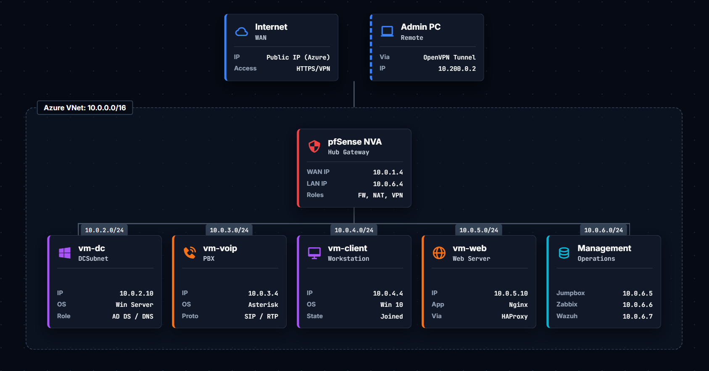

---

### 3.2 Azure Routing (UDR)

**02 — Azure route table forcing subnet traffic through the pfSense NVA.**  
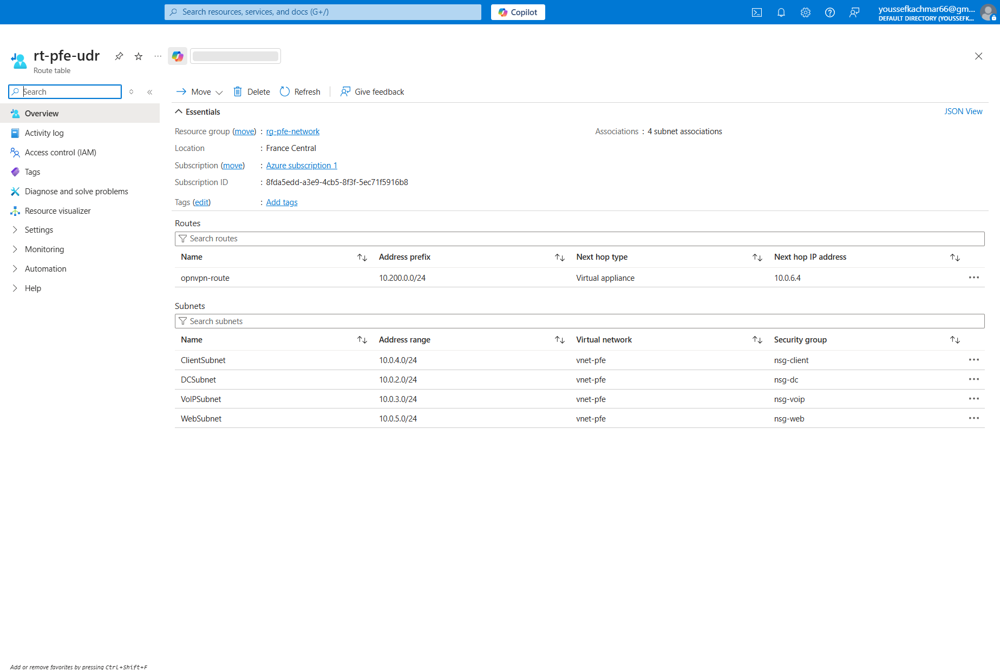

---

### 3.3 pfSense (Gateway Services)

**03 — pfSense dashboard showing the gateway is operational.**  

---

## 4) Remote Access VPN (OpenVPN)

**04 — OpenVPN client connected (remote admin access established).**  
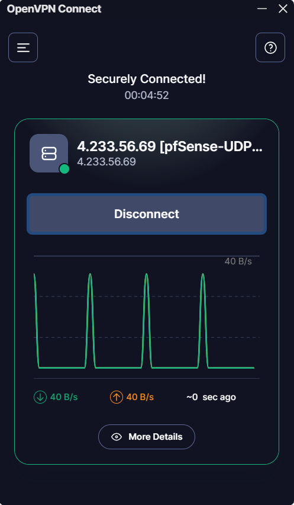

**05 — pfSense OpenVPN status page showing an active client/tunnel address.**  
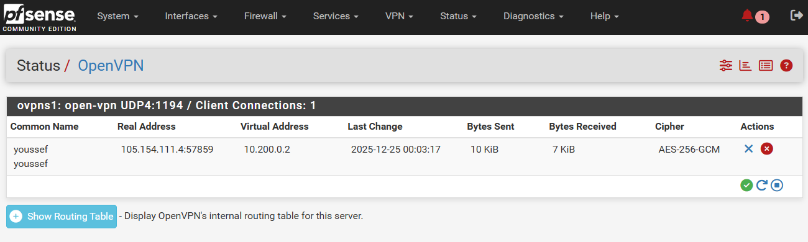

**06 — OpenVPN Certificate Authority (CA) configuration evidence.**  
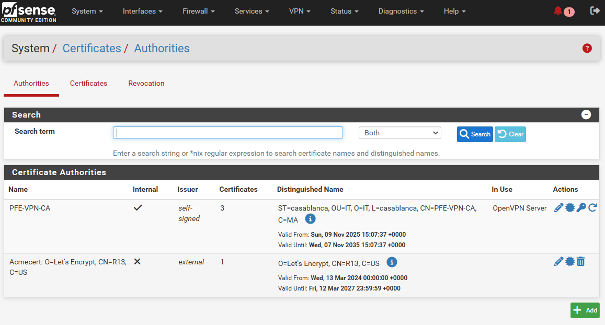

**07 — OpenVPN user certificate evidence (client identity / authentication).**  
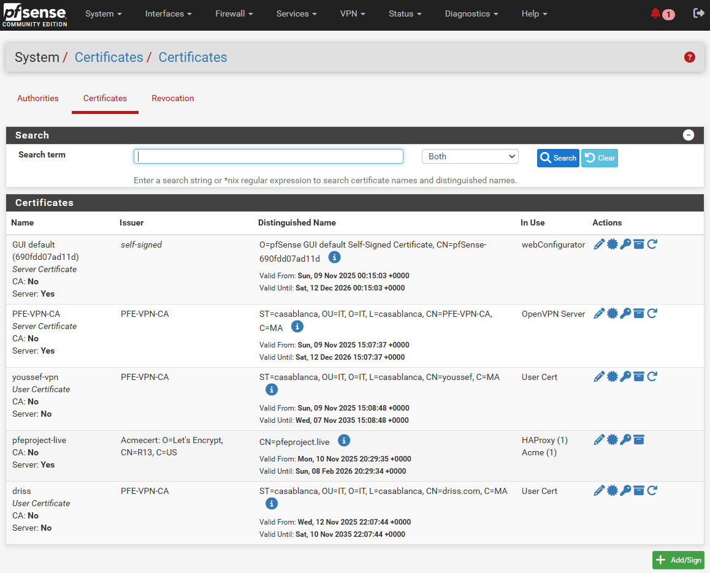

---

## 5) Web Publishing (HAProxy → Nginx) over HTTPS

**08 — HAProxy stats page (frontends/backends health and traffic visibility).**  

**19 — Public website reachable via HTTPS domain `pfeproject.live` (published service proof).**  
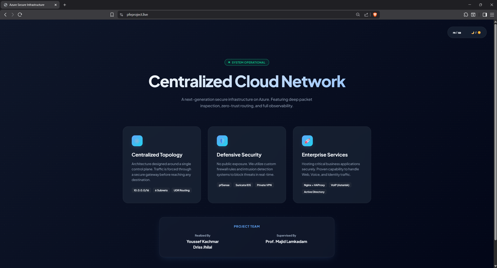

---

## 6) VoIP (Asterisk) + NAT (SIP/RTP)

**09 — Zoiper softphone ringing (call flow proof).**  

**10 — Zoiper incoming call screen (VoIP service reachable).**  

**11 — pfSense NAT Port Forward rules for VoIP: SIP (5060/UDP) + RTP (10000–20000/UDP) → Asterisk host.**  
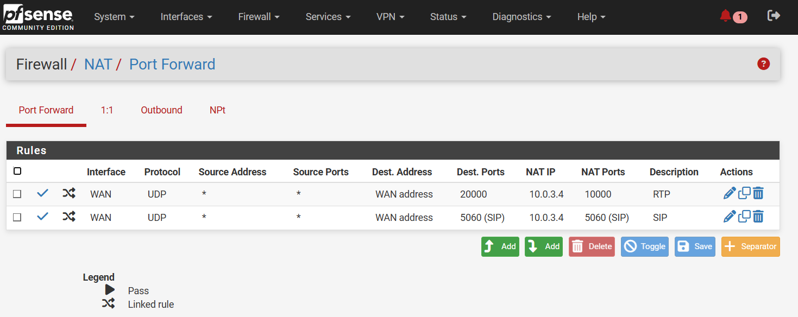

**12 — pfSense Outbound NAT rule with `static-port` enabled (important for stable RTP through NAT).**  
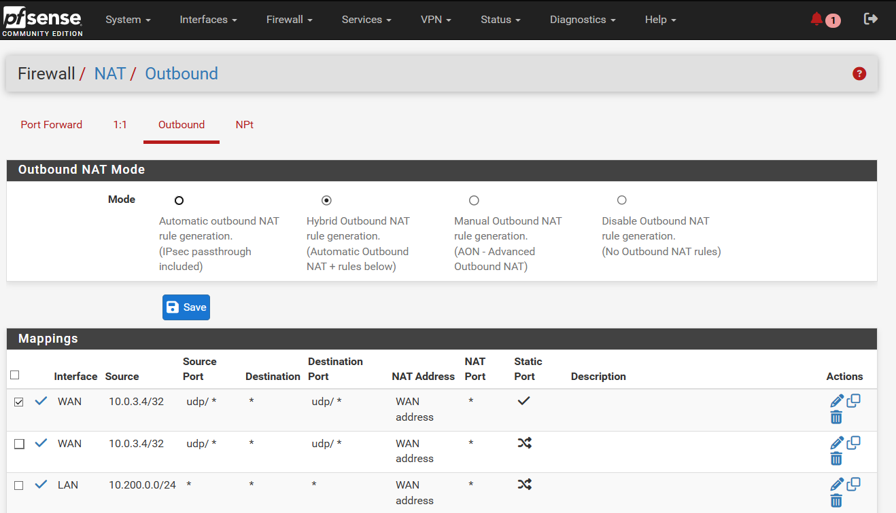

---

## 7) IDS (Suricata)

Suricata is deployed primarily as **IDS (detection)** to inspect traffic and generate alerts for suspicious activity (e.g., scanning / reconnaissance).

**13 — Example detection: Nmap-style probing flagged by Suricata.**  
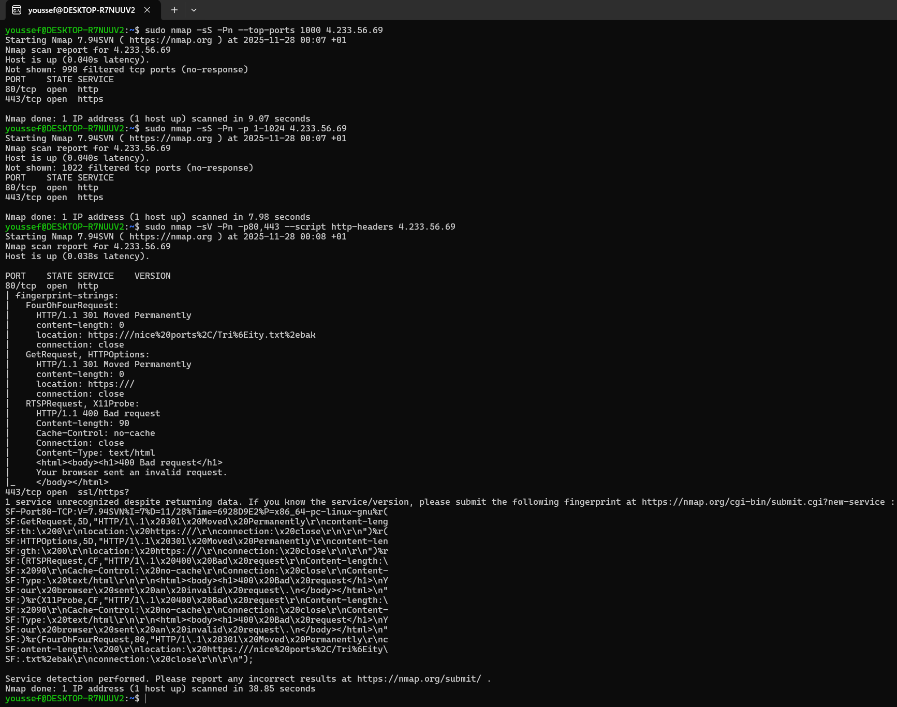

**14 — Suricata alerts view (evidence of detections).**  

**15 — Blocked host evidence (pfSense/security controls showing an IP block related to detection/response).**  
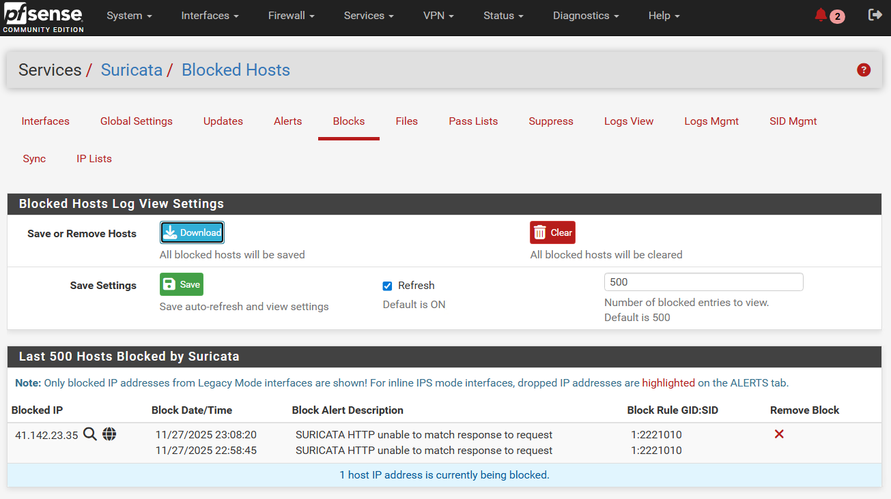

---

## 8) Monitoring (Zabbix)

**16 — Zabbix dashboard (availability/performance monitoring evidence).**  

---

## 9) SIEM (Wazuh)

**17 — Wazuh dashboard (security visibility / SIEM).**  

**18 — Wazuh hosts/agents inventory (endpoint coverage evidence).**  
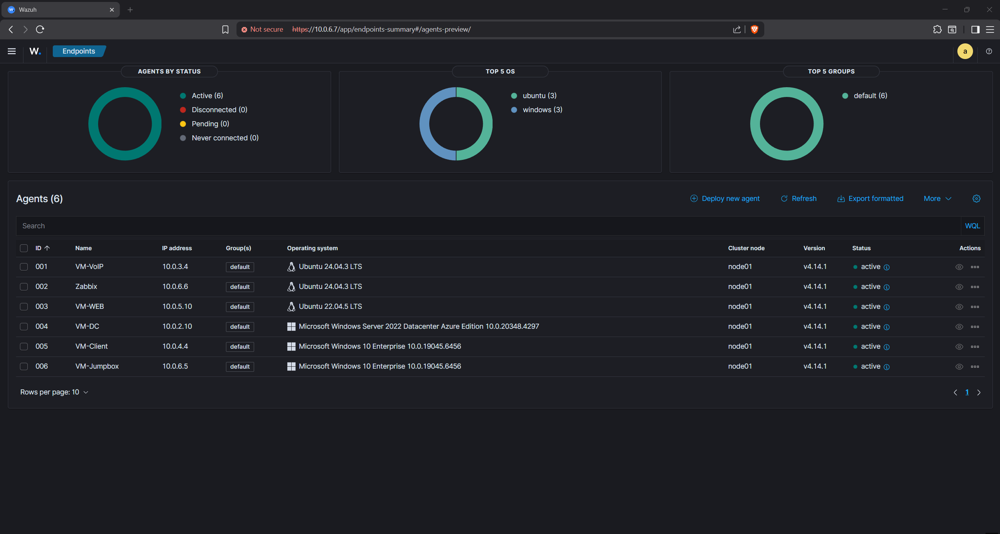

---

## 10) Repository Structure

- `docs/screenshots/` — evidence screenshots referenced by this README

---

## 11) Notes (Public Repo)

- The screenshots include **private RFC1918 IPs** used in the lab design.
- If you fork/reproduce this lab, use your own domain/certificates and follow secure credential handling (do not commit secrets).
- Suricata is documented as **IDS** unless explicitly configured in inline IPS mode.
